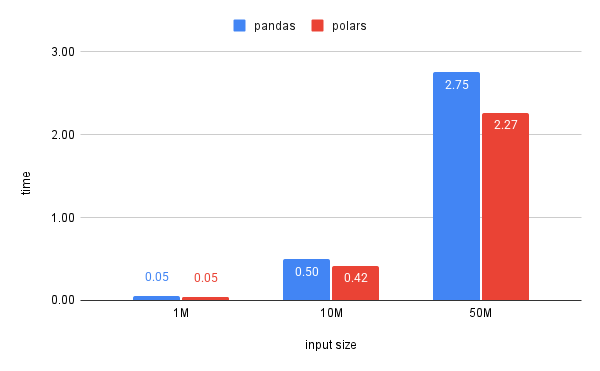

# Pandas vs. Polars: Which One is Faster for My Data Pipeline?

As a data engineer, my daily job involves acquiring data, cleaning it, and storing it in a structured format. A big part of this process is:
- Reading JSON data
- Normalizing it (flatten)
- Writing it into CSV

I’ve been using Pandas for this, but I recently tested Polars to see if it could be a faster alternative. Here are the results (in seconds) for different dataset sizes.

Not a huge difference, but Polars consistently performed slightly better as the data size increased. Since Polars is optimized for multi-threading and lazy evaluation, I’m considering whether it’s worth switching for long-term efficiency.
