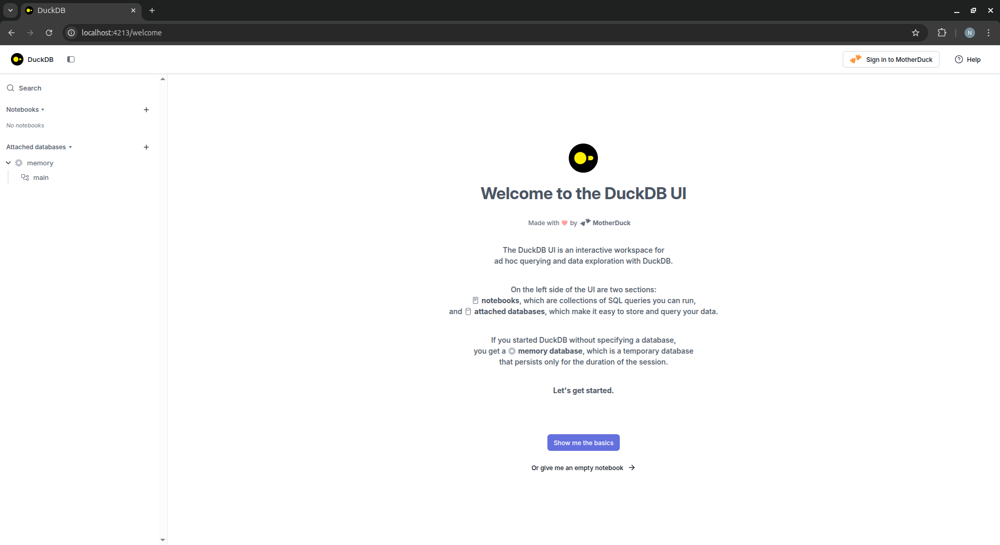
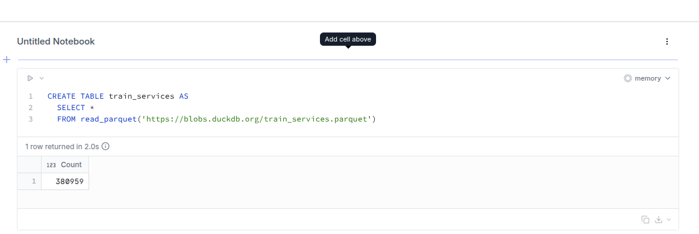
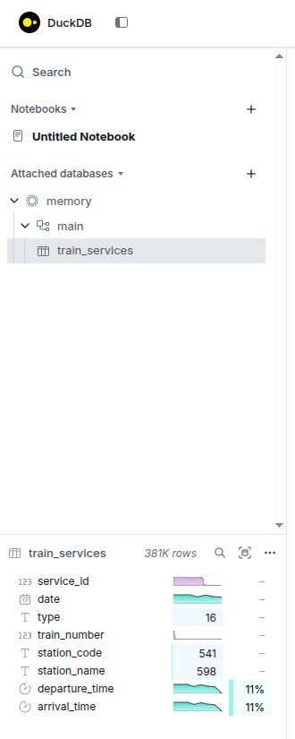
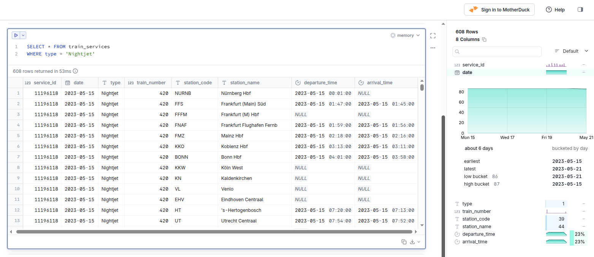

## Human Brain Needs Visual

Our brains are instinctively process images faster and more effectively than text or number. That's why DuckDB provides us a user-friendly interface (or I think so). It's a built-in, web-based, notebook-styled user interface for interacting with DuckDB system.

## Getting DuckDB UI Up and Running

There's two way to getting DuckDB UI up and running:

1. Using DuckDB CLI

  After you installed DuckDB CLI, launching the UI couldn't be simpler:

  ```
  duckdb -ui
  ```

2. Using Docker

  Meanwhile, if you have Docker installed, you can run DuckDB UI using the following docker-compose.yml:

  ```
  services:
    duckdb:
      container_name: duckdb
      image: duckdb/duckdb:latest
      network_mode: host
      command: duckdb -ui /data/my.duckdb
      volumes:
        - "./data:/data"
        - "./duckdb-ui:/root/.duckdb/extension_data/ui"
      restart: unless-stopped
      stdin_open: true
      tty: true
  ```
  
  Then all you need to do is run the following command:
  
  ```
  docker compose up -d
  ```

Those two commands will start DuckDB UI and you can access it at http://localhost:4213

## The UI

When you open it for the first time, it will show you a welcome page with some basic information about DuckDB UI. You can start using it by clicking on the "Show me the basics" or "Or give me an empty notebook" button to skip tutorials.



If you're familiar with Jupyter Notebook or Google Colab, then it will feels like home. And if you're using BigQuery UI, you'll adapt to it very quickly.

Let's just create a new notebook, press "Create Notebook" or "Or give me an empty notebook" if you still on the welcome page.

After creating a new notebook, you can start writing SQL queries in the code cell. For example, you can run the following query to create a table that stores fetched data from an API that returns parquet file:

```
CREATE TABLE train_services AS
  SELECT *
  FROM read_parquet('https://blobs.duckdb.org/train_services.parquet')
```



Now let's dig deeper to the UI features:

### Table Summary

If you click on the table name on the left sidebar, you can see the table summary below it. It shows column names, data types, null counts, and even shows charts of the data of respective column.



### SELECT Summary

When doing SELECT queries, you can see the summary in the right sidebar. It will show you the selected column informations as showed in table summary above.



## Final Verdict

As a former user of a Jupyter Notebook, I'm impressed with DuckDB UI. It's very similar to Jupyter Notebook, but with a more modern and intuitive interface. It's also very fast and efficient, making it a great choice for data analysis and exploration.
And if you're moving from BigQuery UI, you'll get used to it in no time, and you will never want to get back to BigQuery's unintuitive, heavy, and slow interface.
