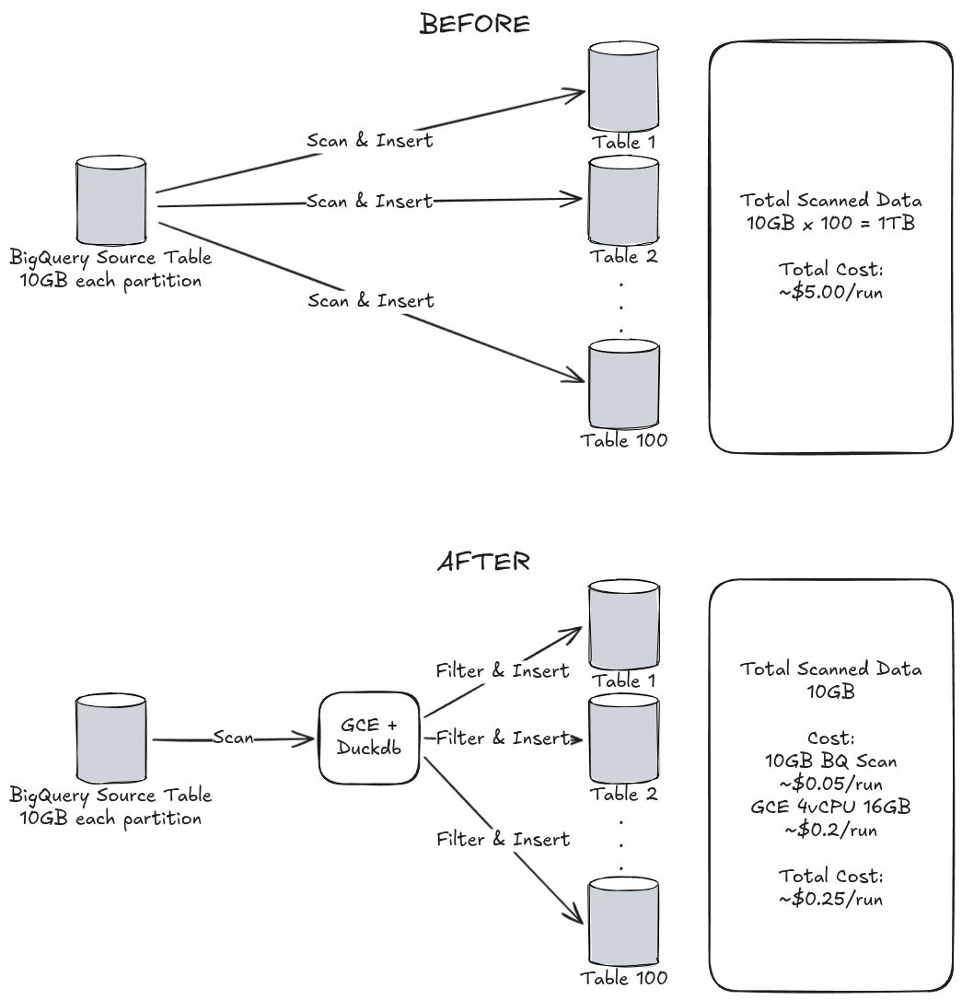

Recently, I was looking at our cloud bill and realized one of our data distribution pipelines was costing us way more than it should. We were looking for a way to cut costs without sacrificing reliability, and DuckDB turned out to be the answer, cutting our spend by 95%.

## The Problem: The "Easy" (but Expensive) BQ Setup

We have a scenario where data from one large partitioned table needs to get pushed into over 100 different downstream tables, each defined by a specific scope. This is a classic "fan-out" problem.

Our previous approach was BigQuery. It was easy to set up: we just ran 100+ separate queries, one for each destination table, filtering the same partition.

Here’s the catch: Every partition is about 10GB. We were scanning that same 10GB data, over the same partition, over 100 times. This meant we were scanning 1TB of data per run, simply to filter and redirect rows. The cost (around $5 per run) scaled linearly with every new table we added. It was inefficient and the cloud bill was starting to hurt.

## The Solution: Moving Computation Closest to the Data

I decided to move away from distributed query execution and try handling the distribution "locally" by introducing DuckDB.

The new design is simpler: We extract the source partition once from BigQuery. This 1TB scan becomes a 10GB extraction.

We then spin up a GCE instance (4 vCPU, 16GB RAM). Inside this instance, DuckDB swallows the extracted partition, handles all the filtering locally, and distributes the data. You can even interact with this data visually using the [[2026-01-10-duckdb-ui]].

## The Results: 95% Savings and a Cleaner Flow

The impact on our budget was dramatic.

- **Old BQ Approach:** 1TB Scanned = ~$5.00/run
- **New GCE+DuckDB Approach:** BigQuery 10GB scan = ~$0.05/run + instance cost for ~1 hour = ~$0.2/run. Total is ~$0.25/run

This change reduced our run cost by about 95%. It also simplified the pipeline logic; we are now running a single extraction and distribution process rather than managing 100+ separate query jobs.

To be clear, DuckDB didn't necessarily run the computational logic faster than BigQuery could. It solved a much smarter problem: it eliminated the massive, redundant network and storage scans that were inflating our costs. Once processed, you can easily export these results using the techniques in [[2026-04-10-duckdb-export-guide]].

## Final Thoughts

This was a great reminder that true optimization often doesn't come from tweaking a WHERE clause or optimizing a join. It comes from stepping back and fundamentally questioning where the computation should happen.

Have you used DuckDB for similar data pipeline or ETL optimization tasks? Curious to hear how others are integrating it into their stacks.
